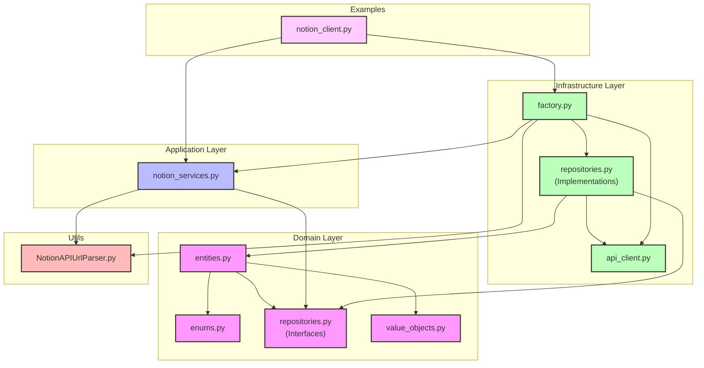

Project structure:

```mermaid
flowchart TD
    %% Main components
    entities[entities.py]
    enums[enums.py]
    repositories_interfaces["repositories.py\n(Interfaces)"]
    value_objects[value_objects.py]
    notion_services[notion_services.py]
    api_client[api_client.py]
    repositories_impl["repositories.py\n(Implementations)"]
    url_parser[NotionAPIUrlParser.py]
    notion_client[notion_client.py]
    factory[factory.py]
    
    %% Subgraphs for layers
    subgraph Domain["Domain Layer"]
        entities
        enums
        repositories_interfaces
        value_objects
    end
    
    subgraph Application["Application Layer"]
        notion_services
    end
    
    subgraph Infrastructure["Infrastructure Layer"]
        api_client
        repositories_impl
        factory
    end
    
    subgraph Utils["Utils"]
        url_parser
    end
    
    subgraph Examples["Examples"]
        notion_client
    end
    
    %% Domain layer connections
    entities --> enums
    entities --> value_objects
    entities --> repositories_interfaces
    
    %% Application layer connections
    notion_services --> repositories_interfaces
    notion_services --> url_parser
    
    %% Infrastructure layer connections
    repositories_impl --> api_client
    repositories_impl --> repositories_interfaces
    repositories_impl --> entities
    factory --> api_client
    factory --> repositories_impl
    factory --> url_parser
    factory --> notion_services
    
    %% Example connections
    notion_client --> notion_services
    notion_client --> factory
    
    %% Styling
    classDef domain fill:#f9f,stroke:#333,stroke-width:2px
    classDef application fill:#bbf,stroke:#333,stroke-width:2px
    classDef infrastructure fill:#bfb,stroke:#333,stroke-width:2px
    classDef utils fill:#fbb,stroke:#333,stroke-width:2px
    classDef examples fill:#fcf,stroke:#333,stroke-width:2px

    class entities,enums,repositories_interfaces,value_objects domain
    class notion_services application
    class api_client,repositories_impl,factory infrastructure
    class url_parser utils
    class notion_client examples
```